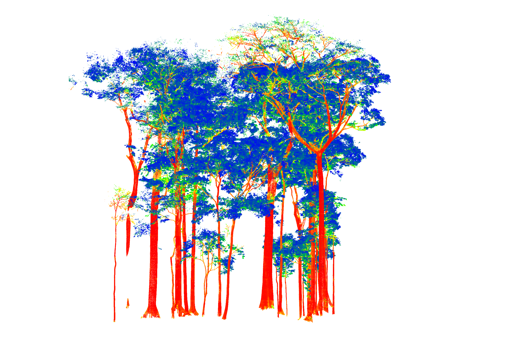

# Semantic classification of wood and leaf in TLS forest point clouds


<sub>Figure is displaying probability of wood predicted by our model from blue (low probability) to red (high probability). (Data sourced from Wang et al., 2021)</sub>

### This model is fully described in the paper:
PointsToWood: A deep learning framework for complete canopy leaf-wood segmentation of TLS data across diverse European forests. Owen, H. J. F.,  Allen, M. J. A., Grieve S.W.D., Wilkes P., Lines, E. R. (in review)

#

### Development Environment

- **Operating System:** Ubuntu LTS 22.04
- **GPU:** NVIDIA Quadro RTX 6000 24GB
- **NVIDIA Driver:** 535.183.06
- **CUDA Version:** 12.2

### Setup Instructions

1. Install the Ubuntu NVIDIA driver (535.183.06 recommended).
   '''bash
   sudo ubuntu-drivers install nvidia:535

2. Install NVIDIA toolkit (https://developer.nvidia.com/cuda-downloads?target_os=Linux&target_arch=x86_64&Distribution=Ubuntu&target_version=22.04&target_type=deb_local)

3. Set up a Conda environment:
   ```bash
   conda create --name myenv python=3.10 mamba -c conda-forge
   conda activate myenv

4. install packages within your Conda environment
   ```bash
   pip install torch torchvision torchaudio --index-url https://download.pytorch.org/whl/cu121
   pip install torch-scatter -f https://data.pyg.org/whl/torch-2.5.1+cu121.html
   pip install torch-sparse -f https://data.pyg.org/whl/torch-2.5.1+cu121.html
   pip install torch-cluster -f https://data.pyg.org/whl/torch-2.5.1+cu121.html
   pip install torch-spline-conv -f https://data.pyg.org/whl/torch-2.5.1+cu121.html
   pip install torch-geometric
   pip install pandas pykdtree numba 

📎 [Pytorch](https://pytorch.org/get-started/locally/) instructions for each OS can be found here.

📎 [Pytorch Geometric](https://pytorch-geometric.readthedocs.io/en/latest/notes/installation.html) instructions for each OS can be found here.

5. Install git lfs to enable the model file to be downloaded.
'''
sudo apt-get install git-lfs
'''

6. Install opt_einsum which is a requirement for KAN module 
'''
pip install opt_einsum
'''

#

### Running PointsToWood
   
1. Activate your conda environment.
   
```
conda activate myenv. 
```

2. Navigate to the PointsToWood directory.
   
```
cd ~/PointsToWood/pointstowood/
```

3. Run PointsToWood.

**Aggressive Wood Detection (Recommended):**
```bash
python3 predict.py --point-cloud ~/PointsToWood/pointstowood/data/eu_eval/uk01_lw_pl_3.ply --model fbeta-eu.pth --batch-size 4 --any-wood 0.50 --grid-size 2.0 3.0 --resolution 0.02 --min-pts 512 --max-pts 16384
```
Use `--any-wood` parameter to apply a more aggressive wood labeling strategy. With this option, a point is classified as wood if ANY neighboring point within its local neighborhood exceeds the wood probability threshold. This approach increases wood detection sensitivity, capturing more potential wood structures that might otherwise be missed but may increase false positives.

**Conservative Wood Detection:**
```bash
python3 predict.py --point-cloud ~/PointsToWood/pointstowood/data/eu_eval/uk01_lw_pl_3.ply --model fbeta-eu.pth --batch-size 4 --is-wood 0.5 --grid-size 2.0 3.0 --resolution 0.02 --min-pts 512 --max-pts 16384 --max-probabilities
```
Use `--is-wood` parameter to apply a more conservative wood labeling strategy. With this option, a point is classified as wood if ALL neighboring points within its local neighborhood exceed the wood probability threshold. This approach increases wood detection specificity, reducing false positives but may miss potential wood structures that might otherwise be detected. The `--max-probabilities` flag selects the most confident prediction in each neighborhood.

## Data Requirements

### Input Format
- **Point Cloud Format**: TLS (Terrestrial Laser Scanner) data
- **Required Columns**: `x y z` (coordinates)
- **Optional Columns**: `reflectance` or `intensity` (recommended for best performance)
- **Point Spacing**: Sub 2 cm optimal, but can function beyond that (not ideal for larger spacing)
- **Processing**: Handles downsampling from raw TLS output automatically

### Output Format
The model will append two new columns to your point cloud:
- **`pred`**: Binary classification (0 = leaf, 1 = wood)
- **`pwood`**: Probability of wood classification (0.0 to 1.0)

## Model Information

### Available Models
- **`fbeta-eu.pth`**: F1-optimized model with slight preference for precision (β = 0.9)
  - Best for applications where precision is slightly more important than recall
  - Trained on European forest data
  - Recommended for most use cases

### Model Selection
The `fbeta-eu.pth` model uses F-beta score optimization with β = 0.9, giving slightly higher weight to precision over recall. This is ideal for applications where false positive wood detections are more costly than missing some wood structures.

Within the model folder, we have biome specific as well as more general ecosystem agnostic models. 


### References 

<sub>Mspace Lab (2024) ‘ForestSemantic: A Dataset for Semantic Learning of Forest from Close-Range Sensing’, Geo-spatial Information Science. Zenodo. https://doi.org/10.5281/zenodo.13285640. Distributed under a Creative Commons Attribution Non Commercial No Derivatives 4.0 International licence. <</sub>

<sub>Wang, Di; Takoudjou, Stéphane Momo; Casella, Eric (2021). LeWoS: A universal leaf‐wood classification method to facilitate the 3D modelling of large tropical trees using terrestrial LiDAR [Dataset]. Dryad. https://doi.org/10.5061/dryad.np5hqbzp6. Distributed under a Creative Commons 0 1.0 Universal licence. <</sub>

<sub>Wan, Peng; Zhang, Wuming; Jin, Shuangna (2021). Plot-level wood-leaf separation for terrestrial laser scanning point clouds [Dataset]. Dryad. https://doi.org/10.5061/dryad.rfj6q5799. Distributed under a Creative Commons CC0 1.0 Universal licence. <</sub>

<sub>Weiser, Hannah; Ulrich, Veit; Winiwarter, Lukas; Esmorís, Alberto M.; Höfle, Bernhard, 2024, "Manually labeled terrestrial laser scanning point clouds of individual trees for leaf-wood separation", https://doi.org/10.11588/data/UUMEDI, heiDATA, V1, UNF:6:9U7BGTgjjsWd1GduT1qXjA== [fileUNF]. Distributed under a Creative Commons Attribution 4.0 International Deed.<</sub>

<sub>Harry, J. F. O., Emily, L., & Grieve, S. (2024). Plot-level semantically labelled terrestrial laser scanning point clouds (1.0) [Data set]. Zenodo. https://doi.org/10.5281/zenodo.13268500<</sub>

