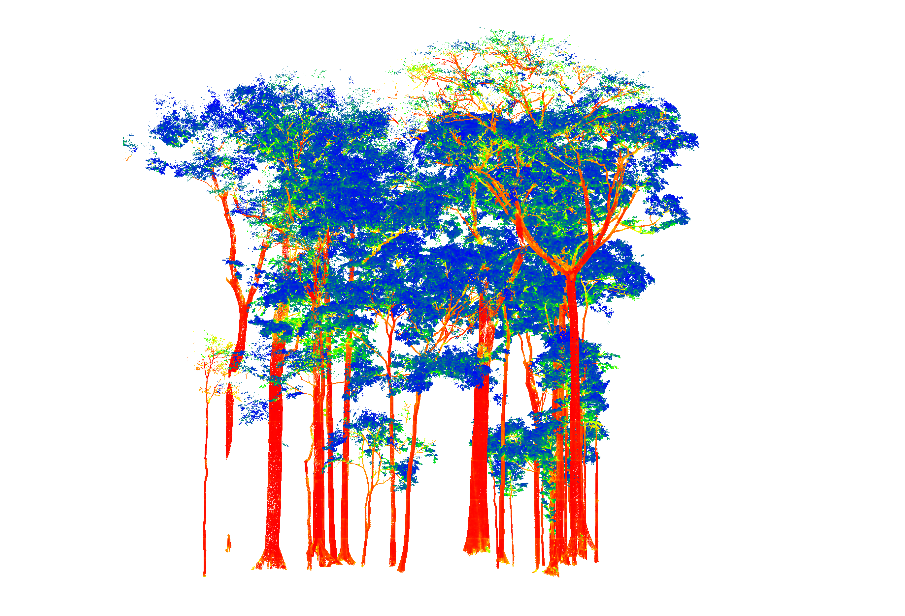

# PointsToWood

**Deep learning framework for wood-leaf segmentation of TLS forest point clouds**


<sub>Probability of wood (blue = low, red = high). Data: Wang et al., 2021.</sub>

---

### Paper

> **PointsToWood: Reflectance-Modulated Anisotropic Convolutions for Leaf-Wood Segmentation Across Diverse Forest TLS Data**
> Owen, H. J. F., Allen, M. J. A., Grieve, S. W. D., Wilkes, P., Lines, E. R. *(under review)*

For the exact implementation described in the arXiv preprint, see the `version1.0-paper` branch:
```bash
git checkout version1.0-paper
```

---

## Overview

PointsToWood classifies every point in a TLS forest point cloud as either **wood** or **leaf**. It is designed for the practical difficulty of the problem: high-resolution point clouds where the target class shifts in scale from individual needles to large trunks, where noise, occlusion, point density, and scanner calibration vary across sites, and where the geometric signal at wood-leaf boundaries is inherently ambiguous.

The model uses a 3-stage encoder-decoder with a custom anisotropic convolution operator that treats LiDAR reflectance not as a flat input feature but as a spatial modulator — shaping which geometric neighbourhoods the network attends to based on material properties. This allows the model to exploit the physical distinction between wood and leaf surface returns while remaining robust when reflectance is unreliable or absent.

A knowledge distillation pipeline produces lightweight biome-specific student models from the full European teacher for fast, low-memory deployment.

---

## Quick Start

```bash
python predict.py --point-cloud your_plot.ply --model h4mcc-eu.pth
```

Output columns appended to the point cloud:
- `prediction` — binary label (0 = leaf, 1 = wood)
- `pwood` — probability of wood (0.0–1.0)

---

## Installation

**Requirements:** Ubuntu 22.04, CUDA 12.2, NVIDIA driver 535+

```bash
# 1. Create environment
conda create --name ptw python=3.10 mamba -c conda-forge
conda activate ptw

# 2. PyTorch + PyG (CUDA 12.1 wheel)
pip install torch torchvision torchaudio --index-url https://download.pytorch.org/whl/cu121
pip install torch-scatter -f https://data.pyg.org/whl/torch-2.5.1+cu121.html
pip install torch-sparse -f https://data.pyg.org/whl/torch-2.5.1+cu121.html
pip install torch-cluster -f https://data.pyg.org/whl/torch-2.5.1+cu121.html
pip install torch-spline-conv -f https://data.pyg.org/whl/torch-2.5.1+cu121.html
pip install torch-geometric

# 3. Other dependencies
pip install pandas pykdtree numba plyfile wandb
```

📎 [PyTorch install guide](https://pytorch.org/get-started/locally/) · [PyG install guide](https://pytorch-geometric.readthedocs.io/en/latest/notes/installation.html)

---

## Model Weights (Git LFS)

```bash
# Install Git LFS
sudo apt-get install git-lfs   # Ubuntu
brew install git-lfs           # macOS
git lfs install

# After cloning, pull weights
git lfs pull                                              # all models
git lfs pull --include="pointstowood/model/h4mcc-eu.pth" # teacher only
```

---

## Inference

```bash
# Full EU teacher model (recommended)
python predict.py --point-cloud your_plot.ply --model h4mcc-eu.pth

# No reflectance available
python predict.py --point-cloud your_plot.ply --model h4mcc-eu.pth --no-reflectance

# Biome-specific distilled model
python predict.py --point-cloud your_plot.ply --model h4mcc-fin.pth
```

**Detection strategies (default: most confident prediction per neighbourhood, max |p−0.5|):**
- `--is-wood 0.5` — wood if mean neighbourhood probability exceeds threshold
- `--any-wood 0.5` — aggressive: wood if any neighbour exceeds threshold

**Input requirements:**
- Format: `.ply`
- Data type: TLS (terrestrial laser scanning)
- Required columns: `x y z`
- Recommended: `reflectance` or `intensity`
- Point spacing: ≤2 cm optimal; adaptive voxelisation handles denser inputs automatically

---

## Training Your Own Model

### 1. Prepare data

Split raw plot files 80/10/10 (train/test/eval) along the x-axis:

```bash
# Single file
python split_ply.py /data/fin_plot1.ply --prefix fin --output data/

# Folder of files
python split_ply.py /data/finland/ --prefix fin --output data/
```

Files are named by ISO 3166-1 alpha-3 prefix (`fin`, `esp`, `pol`, `gbr`, `nor`, etc.) and written to `data/train/`, `data/test/`, `data/eval/`. All regions share one raw pool — voxel preprocessing is per-region to prevent mixing.

### 2. Preprocess and train

```bash
# Train on all European data
python train.py --region eu --preprocess --device cuda

# Train on a single biome
python train.py --region fin --preprocess --device cuda

# Train on everything
python train.py --region global --preprocess --device cuda
```

---

## Knowledge Distillation

Train a lightweight student model from the EU teacher:

```bash
# Distill to a biome-specific student
python distill.py --region fin --preprocess --teacher-model h4mcc-eu.pth

# With PACED frontier-weighted KD (concentrate soft loss on uncertain points)
python distill.py --region fin --preprocess --teacher-model h4mcc-eu.pth --paced

# Scratch baseline (supervised only, no KD — for ablation)
python distill.py --region fin --preprocess --teacher-model h4mcc-eu.pth --scratch
```

Student architecture is configurable:

```bash
--student-c 16          # base channel width
--student-kernels 16    # kernel points (matches teacher geometric resolution)
--student-blocks 1 2 1  # residual blocks per encoder stage
```

---

## Architecture

### The problem

Wood-leaf segmentation in high-resolution TLS is genuinely difficult. The target class spans orders of magnitude in scale — from fine twigs at sub-centimetre resolution to trunk cross-sections metres across. Point density and reflectance calibration vary substantially across sensors and sites. At the boundaries where errors matter most, geometry and reflectance are ambiguous by definition. The architecture is designed around these constraints rather than general-purpose point cloud processing.

### Teacher model (~22M parameters)

A 3-stage encoder-decoder with a custom anisotropic convolution operator.

**Reflectance as a spatial modulator.** Rather than treating LiDAR reflectance as a flat input channel, a per-point gate uses it to weight how strongly each geometric neighbour contributes to the convolution — effectively using material properties to illuminate local structure. The operator remains fully functional without reflectance, falling back to geometry alone.

**Scale and density invariance.** Encoder resolutions scale with input voxel size; neighbourhood distances are normalised by per-neighbourhood maximum rather than a fixed radius. The model is sensor-agnostic by design.

**Boundary-focused supervision.** A multi-scale contrastive loss runs at every encoder stage simultaneously, with labels propagated through the subsampling cascade so boundary points are identified at each geometric scale — not only at the finest resolution after the model has already committed.

**Cyclical focal loss.** The focal exponent follows a cosine schedule: zero at the start (pure cross-entropy for stable early gradients), rising to focus on hard examples mid-training, then tapering for convergence. This resolves the known conflict between focal weighting and early optimisation.

**Decoder.** Grid-based unpooling using encoder cluster indices rather than k-NN interpolation — sharp boundaries, no cross-class averaging.

### Student model (configurable, ~200k–1M parameters)

Same architecture as the teacher, compressed via channel width and block depth rather than geometric resolution — kernel count is kept at K=16 to preserve spatial expressiveness. Trained via knowledge distillation from the teacher with optional frontier-weighted soft targets (concentrating the distillation signal on uncertain boundary points).

---

## Save Criterion — H4-MCC

**H4-MCC** is the harmonic mean of MCC across four evaluation conditions (pure/edge × with/without reflectance). The harmonic mean penalises any weak condition disproportionately — a model that scores well on easy pure samples but degrades at boundaries or without reflectance cannot achieve a high H4-MCC.

---

## Results

*Coming soon — results from the final trained model across European forest types.*

---

## Region and Data Naming

Files follow ISO 3166-1 alpha-3 naming (`fin01.ply`, `esp03.ply`, `gbr01.ply`). The `--region` flag selects which files are used:

| `--region` | Files used |
|---|---|
| `global` | All files in the pool |
| `eu` | All European ISO codes |
| `fin` / `esp` / `pol` / ... | That prefix only |

---

## References

<sub>Mspace Lab (2024) ForestSemantic: A Dataset for Semantic Learning of Forest from Close-Range Sensing. Zenodo. https://doi.org/10.5281/zenodo.13285640.</sub>

<sub>Wang, Di; Takoudjou, Stéphane Momo; Casella, Eric (2021). LeWoS: A universal leaf-wood classification method to facilitate the 3D modelling of large tropical trees using terrestrial LiDAR. Dryad. https://doi.org/10.5061/dryad.np5hqbzp6.</sub>

<sub>Wan, Peng; Zhang, Wuming; Jin, Shuangna (2021). Plot-level wood-leaf separation for terrestrial laser scanning point clouds. Dryad. https://doi.org/10.5061/dryad.rfj6q5799.</sub>

<sub>Weiser, Hannah et al. (2024). Manually labeled terrestrial laser scanning point clouds of individual trees for leaf-wood separation. https://doi.org/10.11588/data/UUMEDI.</sub>

<sub>Owen, H. J. F., Lines, E., & Grieve, S. (2024). Plot-level semantically labelled terrestrial laser scanning point clouds (1.0). Zenodo. https://doi.org/10.5281/zenodo.13268500.</sub>
